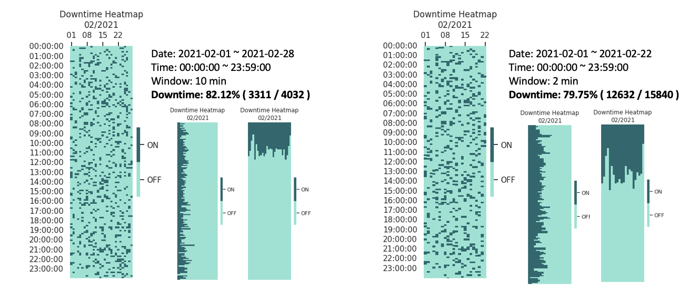
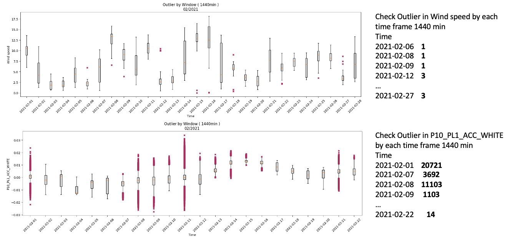
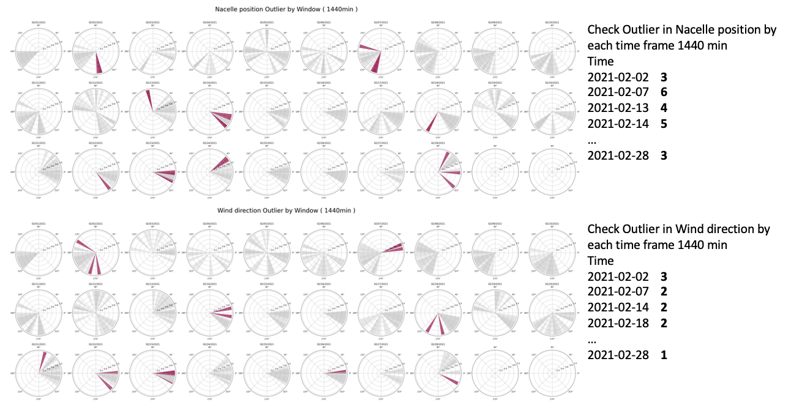
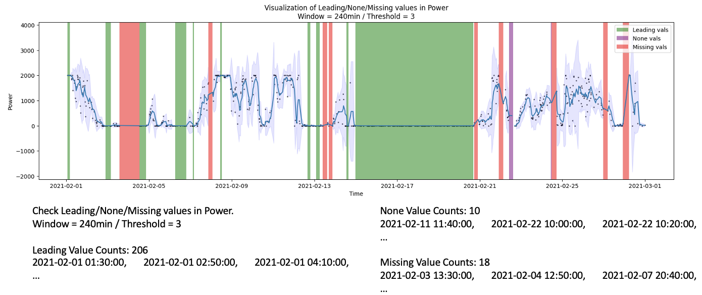

# Exploratory Data Analysis for Ptoon Dataset

### EDA Items

1. __Downtime detection__

    - Set time window and If there is at least one data sample in the time window, it is considered as uptime.

    

    > [EDA_Ptoon.Agent.EDA_SCADA_Downtime](./EDA_Ptoon.py#L303)
    > 
    > [EDA_Ptoon.Agent.EDA_Sensor_Downtime](./EDA_Ptoon.py#L310)

2. __Outlier detection__

    - Inspect outliers based on the window defined by the user.

    - Beyond the whiskers, data are considered outliers. These outliers are logged separately.

    - The result is plotted on the polar coordinate for the angle type channel.

    
    
    

    > [EDA_Ptoon.Agent.EDA_SCADA_Outlier](./EDA_Ptoon.py#L317)
    > 
    > [EDA_Ptoon.Agent.EDA_Sensor_Outlier](./EDA_Ptoon.py#L329)

3. __Leading values detection__

    - Check whether there are 'leading values within specific error threshold', 'None(Recorded with Nan)', or 'Missing(Empty)'.

    - Based on the defined window(min), check the standard deviation of the sliding window in time-series values.

    - If the standard deviation is below the threshold, consider it as the event of leading value occurrence.

    

    > [EDA_Ptoon.Agent.EDA_SCADA_LeadingValue](./EDA_Ptoon.py#L336)
    > 
    > [EDA_Ptoon.Agent.EDA_Sensor_LeadingValue](./EDA_Ptoon.py#L343)

## Contacts
Kim, Hyeongkyun - [@hk-kaden-kim](https://github.com/hk-kaden-kim) - hyeongkyun.kim@uzh.ch

Abdallah, Imad - [@IAbda](https://github.com/IAbda) - abdallah@ibk.baug.ethz.ch
